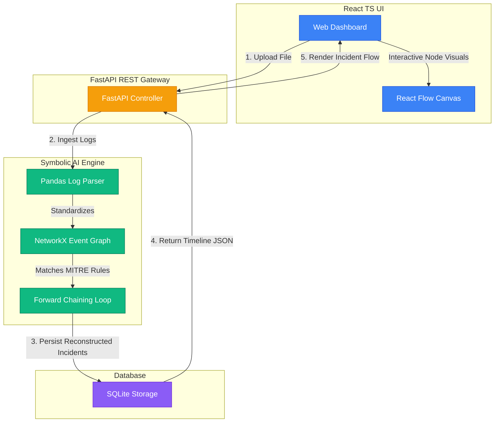
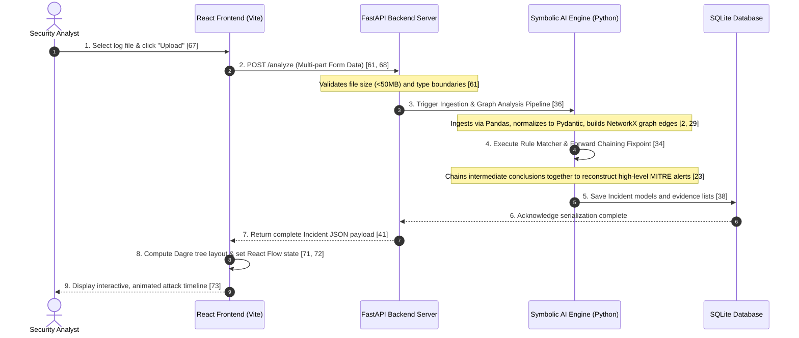

# 🛡️ AI-Powered Cybersecurity Incident Reconstruction & Analysis System

An educational, AI-powered security platform that ingests fragmented operating system and network log files from multiple hosts and reconstructs cohesive, explainable, and interactive attack timelines [1, 80, 81]. By connecting separate events into a unified graph and applying rule-based reasoning, this project turns complex raw data into transparent, actionable security insights [14, 82, 85].

Unlike typical "black-box" systems based on neural networks or LLMs, this platform utilizes **Symbolic AI (Rule-Based Forward Chaining)** [1, 82]. This ensure that every single security conclusion is **100% transparent** and directly traceable back to its original raw log evidence [2, 14].

---

## 📸 Simplified System Architecture & Flow

To make this project easy to understand, we design it as a straightforward **6-stage data and control flow** that coordinates actions between the frontend, the backend parsing/reasoning layers, and database storage:

```text
[ Analyst uploads CSV/JSON ] 
             │
             ▼
 1. WEB FRONTEND (React App + React Flow)
    - Ingests files via UI form and transmits raw payload to the API server [67, 68]
             │
             ▼
 2. API BACKEND GATEWAY (FastAPI REST Server)
    - Thin server wrapper that validates size limits (<50MB) and coordinates routing [40, 61]
             │
             ▼
 3. LOG INGESTION & SCHEMAS (Pandas + Pydantic v2)
    - Normalizes timestamps, handles bad rows, and parses entries to typed Events [2, 27, 55]
             │
             ▼
 4. RELATIONSHIP GRAPH BUILDER (NetworkX)
    - Draws directed edges within ±5-minute windows and maps parent-to-child processes [28, 29]
             │
             ▼
 5. SYMBOLIC AI REASONING ENGINE (Forward Chaining Core)
    - Matches MITRE ATT&CK rules over local neighborhoods until fixpoint convergence [34, 38]
             │
             ▼
 6. DATABASE PERSISTENCE & REST RESPONSE (SQLite + FastAPI Backend)
    - Serializes and stores computed Incident models into SQLite relational storage [38]
    - Packages findings as JSON and delivers the payload back to the React client [40, 41]
             │
             ▼
[ Interactive visual threat timeline rendered dynamically on React Flow Canvas ]
```

---

### 🎨 Visual Architecture Map

Here is how the React frontend, FastAPI backend, and SQLite database interact. It is streamlined to show only the main components:



---

### ⏱️ Chronological Sequence Flow (Step-by-Step)

This simple sequence diagram shows exactly what happens from the moment an Analyst uploads log files:




## 📐 Key Architectural & Graph Modeling Decisions

To satisfy rigorous academic and systems design criteria, several critical engineering decisions were made during development [43]:

1. **Avoidance of Graph Clique Explosion (Negative-Case Suppression):** 
   While events are grouped by shared metadata, the system explicitly **does NOT** draw graph edges for `same_user` or `same_host` [28]. Doing so would create highly dense cliques (fully connected subgraphs) that overwhelm the visual canvas and degrade forward-chaining evaluation performance [43, 45]. Instead, `user` and `host` are preserved as **matchable node attributes** inside rule evaluation, rather than physical graph edges [28].
2. **Local Graph-Neighborhood Rule Matching:**
   Instead of running costly global rule matching (which scales quadratically with log size), rules are evaluated **graph-locally** [43]. The engine extracts local neighborhoods around active nodes (restricted to the temporal \(\pm\)5-minute window) and matches rule schemas within this focused scope, keeping execution highly scalable [34, 43].
3. **Stable Unique Conclusion Instance-IDs (G6 Architectural Fix):**
   In early development phases, parent evidence traces referenced the rule template ID (e.g., `"PSH-STAGING-01"`), which led to React Flow visual rendering collisions when rules triggered multiple times [50]. In the current production release, every conclusion is assigned a **stable unique UUID (`conclusion_id`)**, allowing the React Flow edge generator to draw clear, collision-free multi-level dependencies [63, 64].

---

## 🎯 What This System Solves

Security analysts are often overwhelmed by thousands of disconnected security log entries (e.g., file downloads, process starts, registry changes) [80]. 

This system automates log correlation by:
1. **Parsing and Standardizing** raw logs (CSV/NDJSON) into high-fidelity structured Events [84, 86].
2. **Connecting Relationships** between events (such as temporal proximity, parent/child processes, and shared system objects) inside a unified Event Graph [23, 85, 86].
3. **Evaluating Pre-defined Rules** grounded in the **MITRE ATT&CK** framework to reconstruct multi-stage incident scenarios [31, 85].
4. **Providing Complete Evidence Trace-Back**, allowing users to click any security conclusion to inspect the exact log entries that triggered it [2, 86, 88].

---

## ⚙️ Tech Stack

### Backend
* **Language:** Python 3.11+ (Ecosystem for data processing & reasoning rules) [2]
* **API Framework:** FastAPI (Thin, high-performance REST wrapper) [2, 83]
* **Data Processing & Validation:** Pandas (efficient log parsing) [2, 84] & Pydantic v2 (typed contracts & automatic schema validation) [2, 84]
* **Graph Modeling:** NetworkX (in-memory directed graph of events) [2, 85]
* **Storage:** SQLite (lightweight, zero-setup relational database for saved incidents) [2, 86]

### Frontend
* **Core Framework:** React + TypeScript + Vite (fast, type-safe development) [52, 66]
* **Graph Visualization:** React Flow (`@xyflow/react` v12) [52, 72] & Dagre Layout Engine (`@dagrejs/dagre` for automated left-to-right tree layout) [52, 72]
* **Styling:** Custom CSS (sleek, dark-mode SOC Analyst theme) [52, 77]

---

## 🗂️ Project Directory Layout

```text
src/
├── app/
│   ├── __init__.py
│   ├── main.py              # FastAPI Web API entrypoint (CORS-enabled)
│   ├── models.py            # Pydantic data contracts (Event, Conclusion, Incident)
│   ├── parser.py            # Log parser (CSV + Mordor NDJSON)
│   ├── graph.py             # NetworkX graph builder (edge semantics)
│   ├── rules/               # Knowledge base (MITRE ATT&CK rules as plain Python)
│   │   ├── __init__.py
│   │   └── registry.py      # Rule registration list
│   ├── engine.py            # Forward-chaining reasoning engine (with fixpoint limits)
│   ├── orchestrator.py      # Pipeline orchestrator & CLI entrypoint
│   └── storage.py           # SQLite persistence layer
├── data/
│   ├── attack_sample.csv    # Custom simulated attack log chain
│   ├── benign_sample.csv    # Standard log activity (negative-case validation)
│   └── README.md            # Simulated dataset narrative documentation
├── tests/                   # Complete pytest suite
│   ├── test_models.py
│   ├── test_parser.py
│   ├── test_graph.py
│   └── test_engine.py
├── requirements.txt         # Backend dependencies
├── package.json             # Frontend dependencies
├── README.md                # This documentation file
└── .gitignore
```

---

## 🔬 Taxonomy & Supported Events

The system normalizes diverse operating system and network log sources into **7 Core Event Types** [3, 5, 55]:

| Our Event Type | Description | Source Log Indicators [5, 45, 55] |
|---|---|---|
| `process_execution` | A process is executed or spawned | Sysmon EventID 1 / Windows Security 4688 |
| `file_download` | A file is downloaded from the network | Sysmon EventID 11 / Zeek logs / `bitsadmin` |
| `file_creation` | A file is created or written to disk | Sysmon EventID 11 |
| `registry_modification` | A registry key or value is altered | Sysmon EventID 12/13 (Registry Set/Delete) |
| `network_connection` | Network connection (inbound/outbound) | Sysmon EventID 3 / Zeek flow |
| `powershell_execution` | A PowerShell command block is run | Windows PowerShell EventID 4104 |
| `log_deletion` | Audit logs are cleared to cover tracks | Windows EventID 1102 (Log Clear) |


### 📑 Real-Log Message Block Key-Value Parser (Mordor / Sysmon Ingestion)

To handle real-world operating system audits without relying on pre-processed CSVs, the parser implements raw **Mordor/OTRF NDJSON log ingestion** [26, 48, 52]. 

A raw Sysmon log delivers structured fields inside a generic string text block under the `Message` attribute [4, 6]. The ingestion engine (`app/parser.py`):
1. Reads raw JSON lines and extracts the multi-line `Message` string [55].
2. Uses key-value parsing (e.g., separating on `Key: Value` line breaks) to construct a structured metadata dictionary of Sysmon indicators like `Image`, `CommandLine`, `ProcessId`, and `ParentProcessId` [4, 55].
3. Maps native Sysmon and Windows EventIDs dynamically to our internal Pydantic Event schema [27, 55]:
   * **EventID 1 / 4688** $
ightarrow$ `process_execution` [54]
   * **EventID 3** $
ightarrow$ `network_connection` [54]
   * **EventID 11** $
ightarrow$ `file_creation` / `file_download` [54]
   * **EventID 12 / 13** $
ightarrow$ `registry_modification` [54]
   * **EventID 4104** $
ightarrow$ `powershell_execution` [54]
   * **EventID 1102** $
ightarrow$ `log_deletion` [54]
4. Preserves complete log provenance by tagging each parsed Event with an immutable, traceable ID in the format: `file_path:line_number` [20, 26].

---

## 🧠 The Symbolic AI Engine & Rules

The reasoning engine employs a **Fixpoint Loop** with forward-chaining rules [34, 35, 84]. The engine evaluates local sub-graphs (neighborhoods) and derives conclusions until no new information can be learned [34, 35]. It includes a `MAX_ITERATIONS = 10` safety cap to prevent infinite loops [34, 44].

The reasoning engine leverages a pre-integrated **Knowledge Base of 5 Security Rules** mapped to MITRE ATT&CK tactics [23, 31, 63, 65]:

* **`REG-PERSIST-01` (MITRE T1547.001 - Registry Run Keys):** Detects persistence. Triggered when a process execution is followed by a registry run key modification within a 5-minute window [22, 31].
* **`PSH-STAGING-01` (MITRE T1059.001 - PowerShell Staging):** Detects execution. Triggered when a PowerShell execution and a file download occur close together within a 5-minute window [22, 31].
* **`PERSIST-ESTABLISHED-01` (Multi-stage Chained Rule):** An advanced rule that consumes the conclusions of previous rules (such as staging and registry alerts) to assert that a persistent foothold is actively established on the host. This demonstrates **two-level forward-chaining** [22, 63].
* **`C2-BEACON-01` (MITRE T1071 - Command & Control Beaconing):** Triggered when a process execution is followed by an outbound network connection to a target destination IP address within the active temporal window [63].
* **`LOG-CLEAR-01` (MITRE T1070 - Defense Evasion):** Triggered when log deletion event signatures are detected (e.g., executing `wevtutil cl` or triggering EventID 1102), indicating active trail-covering [25, 44, 63].

---

## 🚀 Setup & Installation

### Backend Setup
1. **Navigate to the `src` directory and create a virtual environment:**
   ```bash
   python -m venv .venv
   source .venv/bin/activate  # On Windows use: .venv\Scripts\activate
   ```
2. **Install the dependencies:**
   ```bash
   pip install -r requirements.txt
   ```
3. **Run the pipeline via CLI to test on the simulated attack logs:**
   ```bash
   python -m app.orchestrator data/attack_sample.csv
   ```
   *This will print the fully reconstructed incident timeline as formatted JSON to stdout!* [17, 37]

4. **Start the FastAPI server:**
   ```bash
   uvicorn app.main:app --reload
   ```
   *Once started, open your browser and navigate to `http://localhost:8000/docs` to play with the interactive API documentation.* [40]

### Frontend Setup
1. **Navigate to the frontend folder (e.g., `incident-dashboard`):**
   ```bash
   npm install
   ```
2. **Launch the Vite development server:**
   ```bash
   npm run dev
   ```
3. **Open the web application:**
   Navigate to `http://localhost:5173` to upload logs, view the chronological timeline of conclusions, and interact with the animated attack chain. [67, 73]

---

## 🧪 Testing

We keep our tests robust and simple [42]. You can verify every single layer of the pipeline independently [15, 42]:

```bash
# Run the complete test suite
pytest -v
```

This tests:
* Unit-level model parsing & validation [42].
* Graph edge generation rules [42].
* Chaining-rule triggers (positive testing) and benign background suppression (negative testing) [42].


---

## 🚧 Project Boundaries & Explicitly Deferred Features

To keep the development scope highly focused on explainable incident reconstruction, the following items are explicitly designated as out-of-scope for Phase 1 & Phase 2, and are deferred to subsequent production cycles [45, 76]:

| Deferred Capability | Architectural Rationale for Deferral [45, 76] | Alternate Implementation Used |
|---|---|---|
| **PostgreSQL Database** | Avoids heavy container orchestration overhead during student evaluation [45, 76]. | Lightweight **SQLite Database** file containing serialized JSON [37, 38]. |
| **Authentication & RBAC** | Localhost demonstration environment has zero sensitive production data [76]. | Direct public access on localhost client/server porting [60, 66]. |
| **Global State Library** | Reconstructed state relies on a single complex incident object [76]. | Simple **React Context** and parent `useState` hook mapping [76]. |
| **Real-Time Streaming** | Real-time agent ingestion introduces significant socket networking complexity [45]. | Batch-based log uploads (`.csv` and `.json`) via multipart browser forms [61, 85]. |
| **Docker & CI/CD** | Demonstration is run locally to enable interactive terminal testing [45, 76]. | Local Python Virtual Environments (`.venv`) and npm scripts [17, 66]. |
